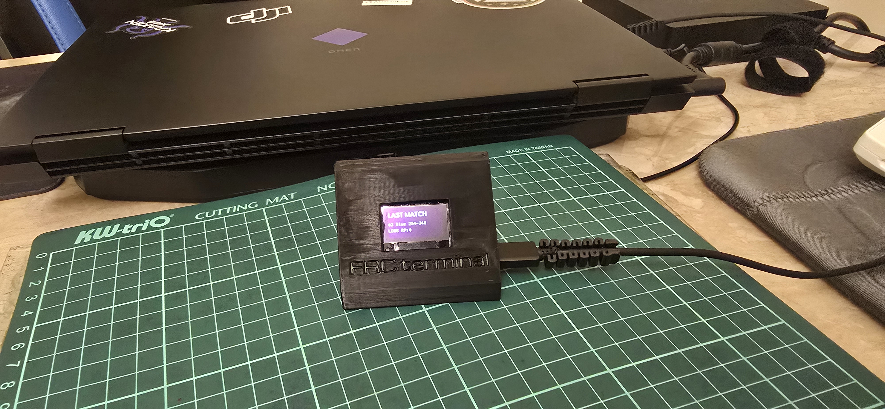
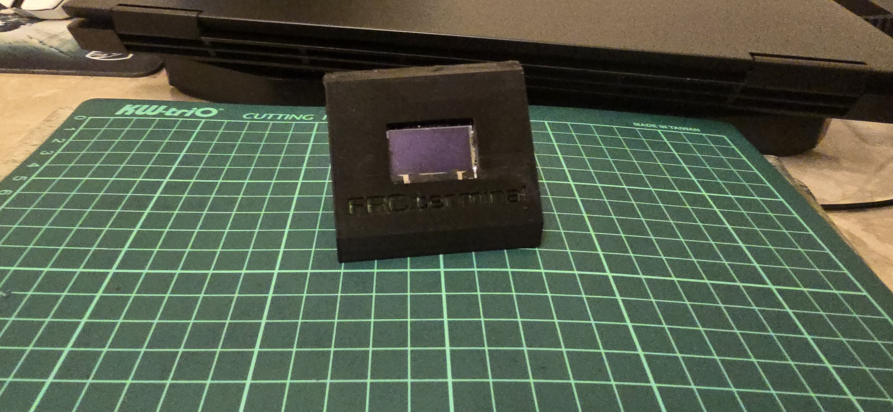
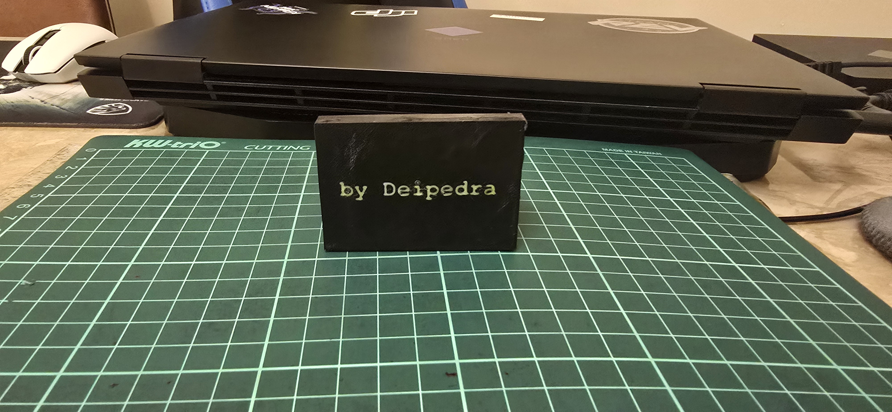

  

  
  

  
  
  
  
  
  

# FRC Pit Terminal

An ESP8266 + OLED pit display built for FRC (FIRST Robotics Competition) teams. It sits in the pit area and continuously cycles through team info, the current time, WiFi status, the next scheduled match, and the result of the last completed match (score, alliance color, win/loss, and Ranking Points) pulled live from The Blue Alliance (TBA) API. An active buzzer sounds a short alert whenever a new match is announced, so the team doesn't have to watch the screen constantly.

The project is team-agnostic: nothing is hardcoded. On first boot, the device opens its own configuration portal so any team can set their WiFi credentials, TBA API key, event key, and team name/number without ever touching the code.

---

## Features

| | |
|---|---|
| **Live match data** | Pulled directly from The Blue Alliance API v3 |
| **Auto timezone** | Detected from the network's public IP, refreshes every 30 minutes |
| **Web-based setup** | WiFi and project settings entered through a page the device hosts itself - no reflashing to change them |
| **Buzzer alerts** | Active buzzer beeps when a new match is announced |
| **Persistent settings** | Stored in onboard flash, survives reboots and power loss |
| **Two display modes** | Works with both SPI (6-pin) and I2C (4-pin) OLED wiring |
| **Two languages** | Turkish and English firmware variants included |

## Hardware Required

| Part | Notes | Approx. Price |
|---|---|---|
| ESP8266 dev board | NodeMCU 1.0 / ESP-12E recommended | ~$3-5 |
| 128x64 OLED display | SSD1306 or SH1106, SPI (6-pin) or I2C (4-pin) | ~$3-6 |
| Active buzzer | 2 or 3 pin, 3.3V-5V tolerant | ~$0.50-1 |
| USB cable | Must be data-capable, not charge-only | - |
| Jumper wires | Male-to-female, for breadboard/header connections | ~$2 for a pack |

Prices are rough estimates for common marketplace listings (AliExpress/Amazon) and will vary by region and seller.

## Quick Start

1. Open `FRC_terminal_tr.ino` (Turkish UI) or `FRC_terminal_en.ino` (English UI) in Arduino IDE.
2. Install the required libraries via Library Manager: **U8g2**, **WiFiManager**, **ArduinoJson**, **NTPClient**.
3. Select your board: `Tools > Board > ESP8266 Boards > NodeMCU 1.0 (ESP-12E Module)`.
4. Wire the OLED and buzzer as described in [DOCUMENTATION.md](./DOCUMENTATION.md).
5. Upload the sketch.
6. On first boot, the ESP8266 broadcasts its own WiFi network (e.g. `GoldenHorn-Setup`). Connect to it with a phone or laptop.
7. A setup page should open automatically. If it doesn't, browse to `192.168.4.1`. Enter:
   - Your real WiFi network name and password
   - A TBA **Read** API key ([thebluealliance.com/account](https://www.thebluealliance.com/account))
   - Your event's TBA event key (e.g. `2026flor`)
   - Your team name and number
8. Save. The device restarts, connects to your real WiFi, and starts cycling through its screens.

Settings can be changed later without reflashing - see [DOCUMENTATION.md](./DOCUMENTATION.md).

## What It Shows

The OLED rotates through five screens every 5 seconds:

1. **Team** - team name and number
2. **Clock** - current time, timezone auto-detected from IP
3. **WiFi Status** - connection state and local IP address
4. **Next Match** - upcoming match number from TBA (buzzer beeps 3 times on a new match)
5. **Last Match** - most recently completed match: number, alliance, score, result, and RP if available

## FAQ

**Does this work with any FRC team?**
Yes. No team information is hardcoded - everything is entered through the device's own setup page on first boot.

**Do I need to know the event ahead of time?**
Yes, you need the event's TBA event key (e.g. `2026flor`) entered in settings. If it changes (new event, new season), just revisit the settings page - no reflashing needed.

**What happens if I take the device to a different timezone?**
Nothing you need to do manually - the clock re-detects the timezone from the network's IP every 30 minutes.

**Can I use a passive buzzer instead of an active one?**
Not without a code change. Active buzzers only need `digitalWrite(HIGH/LOW)`; a passive buzzer needs a `tone()` call to generate its own frequency.

**My screen shows nothing / garbled pixels.**
Most likely the display controller doesn't match the code (SSD1306 vs SH1106), or VCC is wired to 5V instead of 3V3. See [DOCUMENTATION.md](./DOCUMENTATION.md#troubleshooting).

## Acknowledgments

This project builds on the work of:

- [U8g2](https://github.com/olikraus/u8g2) by olikraus - OLED display driver
- [WiFiManager](https://github.com/tzapu/WiFiManager) by tzapu - WiFi provisioning and captive portal
- [ArduinoJson](https://arduinojson.org/) by Benoit Blanchon - JSON parsing
- [NTPClient](https://github.com/arduino-libraries/NTPClient) by Fabrice Weinberg - network time sync
- [The Blue Alliance](https://www.thebluealliance.com/) - free, open FRC match data API
- [worldtimeapi.org](https://worldtimeapi.org/) - free IP-based timezone lookup

## Documentation

Full wiring diagrams (SPI vs I2C displays), buzzer pin notes, library setup, and a troubleshooting guide are in [DOCUMENTATION.md](./DOCUMENTATION.md).

## License

MIT - see [LICENSE](./LICENSE).

---

-by Deipedra

